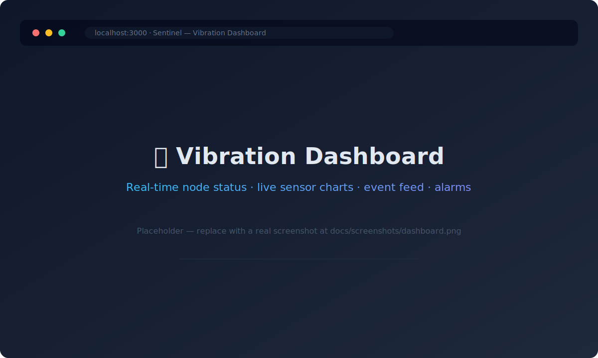
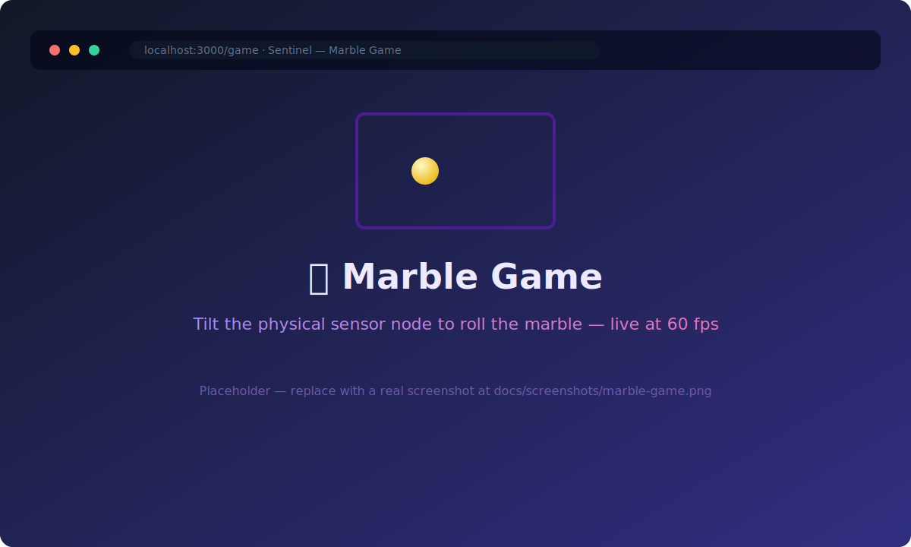
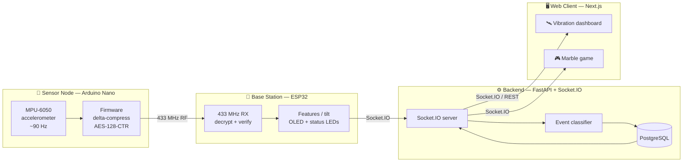

# Sentinel

**A real-time wireless sensor platform.** Battery-powered nodes stream AES-encrypted,
delta-compressed accelerometer data over 433&nbsp;MHz RF to an ESP32 base station, which relays
it to a FastAPI + Socket.IO backend and a live web client — end to end, at interactive latency.

The platform is demonstrated with **two applications** built on the same pipeline:

- 🛰️ **Vibration monitor** — a real-time dashboard of node status, impact events, alarms, and system health.
- 🎮 **Marble game** — a tilt-controlled game where you physically tip the sensor node to roll a marble on screen.

This monorepo combines the three components of the system (hardware/firmware, backend API,
and web frontend) into a single repository.

> Built by **Team EN04** as an integration project at UC Leuven-Limburg (UCLL), May 2026.
> **My role:** hardware / IoT lead — sensor-node and base-station firmware, the RF protocol,
> compression, and encryption. See [Team & attribution](#team--attribution).

---

## Screenshots

> ℹ️ The images below are **placeholders**. Replace `docs/screenshots/dashboard.svg` and
> `docs/screenshots/marble-game.svg` with real captures of the running apps (any web-friendly
> format works — just keep the same filenames, or update the paths below).

| Vibration Dashboard | Marble Game |
| :---: | :---: |
|  |  |
| Live node status, sensor charts, event feed & alarms | Tilt the physical node to roll the marble in real time |

## Architecture

Each Nano samples at ~90&nbsp;Hz and transmits delta-compressed, AES-128-encrypted packets
over 433&nbsp;MHz RF. The ESP32 base station receives, decrypts, and dispatches packets by
node ID, derives per-window features (or tilt angles), drives an OLED and status LEDs for local
feedback, and streams the result to the backend over Socket.IO. The backend classifies and
persists events to PostgreSQL and re-broadcasts them to web clients in real time — driving both
the vibration dashboard and the marble game.

## Hardware

|  |  |  |
| :---: | :---: | :---: |
| **Arduino Nano** (ATmega328P) — sensor node | **ESP32** — base station | **MPU-6050** — accelerometer |

The node samples the MPU-6050, delta-compresses and AES-encrypts the readings, and transmits
them over a 433&nbsp;MHz RF link; the ESP32 base station decrypts, derives features, and forwards
over Socket.IO. Full build notes and wiring are in
[`backend/documentation/hardware/HARDWARE.MD`](backend/documentation/hardware/HARDWARE.MD) and
[`iot/README.md`](iot/README.md).

## Repository layout

| Path         | Component        | Stack                                                     |
| ------------ | ---------------- | --------------------------------------------------------- |
| [`iot/`](iot)         | Hardware / firmware | Arduino Nano (C++), ESP32 (C++), MPU-6050, 433&nbsp;MHz RF |
| [`backend/`](backend) | REST API + realtime | Python, FastAPI, Socket.IO, PostgreSQL, Alembic, Docker    |
| [`frontend/`](frontend)| Web client          | TypeScript, Next.js, React, Recharts, Jest                |

Each subfolder keeps its own README with detailed setup instructions.

## Quick start

Each component runs independently — see the per-component READMEs:

- **Hardware / firmware:** [`iot/README.md`](iot/README.md)
- **Backend API:** [`backend/README.md`](backend/README.md) — Python 3.11+, `docker compose up -d`, `alembic upgrade head`
- **Frontend dashboard:** [`frontend/README.md`](frontend/README.md) — Node.js 18+, `npm install`, `npm run dev`

The frontend expects the backend running on `http://localhost:8000`; the backend receives
data from the base station over Socket.IO.

## Highlights

- **Custom RF protocol** — delta-compressed sensor packets with AES-128-CTR encryption over
  433&nbsp;MHz, with per-node dispatch on the base station.
- **Real-time pipeline** — sensor → base → Socket.IO → backend → web client, end to end at interactive latency.
- **Signal processing on-device** — the base station derives per-window features (peak, RMS,
  zero-crossing rate, decay) or tilt angles, which the backend classifies server-side.
- **Production-minded tooling** — Docker Compose, Alembic migrations, monitoring, CI code-quality
  gates (ruff / ESLint / Prettier), and test suites across backend and frontend.

## Team & attribution

Sentinel was a group project by **Team EN04** (UCLL Integration Project, May 2026). This
monorepo is maintained by **[Zakaria Shahruri](https://github.com/ZakariaShahruri)**, who
led the **hardware / IoT** component (sensor firmware and ESP32 base station).

The commit history preserves original authorship: each component's commits are attributed to
its lead contributor, with `Co-authored-by` trailers crediting the full team.

**Contributors** (Team EN04):

- Joseph Anise — scrum master
- Mohamed Bya — integration engineer
- Nathan Pennings — frontend lead
- Zakaria Shahruri — hardware / IoT lead
- Oleksandr Uvarov — backend lead
- Milan Vandenbussche — product owner
