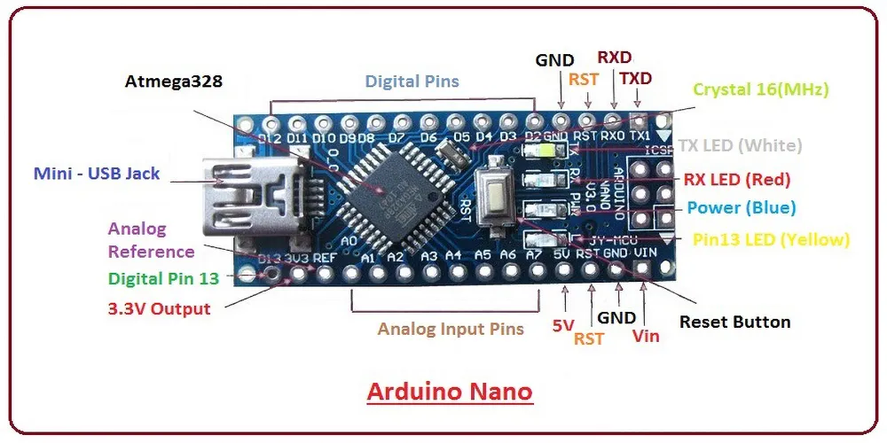
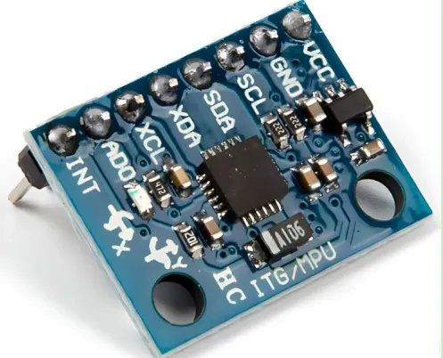

# Arduino nano



### Microcontroller 
First, let's define what a microcontroller is because Arduino nano is a microcontroller
(wrapped in a friendly package). A microcontroller is a tiny, complete computer,
but unlike a standard PC, it's designed to do one specific job repeatedly, forever.
It has a processor and a small amount of memory.

The Arduino Nano is a small development board built around a microcontroller chip called the ATmega328P.
The chip cannot do anything on its own, so Nano surrounds it with other things:

* A USB port so you can plug it into a computer and upload a program to it
* A voltage regulator so you can power it from a variety of sources (USB, battery) and it'll sort out a stable 5V internally
* A crystal oscillator - a tiny component that vibrates at exactly 16 million times per second, giving the chip a heartbeat to count time against
* Breakout pins along both sides so that you can easily plug wires into it

### How it actually works

At the heart of every modern microcontroller are transistors. A transistor is, at its most basic, an
electronically controlled switch. You feed a small voltage into one leg of it, and it opens or closes
a connection between the other two legs. That's why it's powerful; a lot of them combined, and you have
a big logic of AND & OR branches defined by 0/1 (whether a transistor is turned on).

The binary system maps directly onto this physics: a voltage of 5V on a pin is a "1", a voltage of
~0V is a "0".
Everything the Nano does - reading from a sensor, calculating a feature, deciding what event class
something is - ultimately reduces to billions of these tiny switches flipping on and off, millions
of times per second.

What the Arduino Nano does in this project

1. Reading the accelerometer. Through its I2C or SPI pins (see below what an acelerometer is), it constantly
requires fresh vibration measurements 200 times every seconds. Each reading arrives as a number, and the 
Nano stores these numbers in a buffer in its memory.
2. Running the classifier. Once 256 samples have accumulated (about 1.3 seconds of data), the Nano performs
the feature extraction calculations.
3. Transmitting the result. 

---  

# ESP32


## What is it?

The ESP32 is a microcontroller just like the Arduino nano except, the ESP32 is significantly more powerful. The ESP32 is built around a dual-core 32-bit processor running at up to 240MHz with 520KB of RAM. This extra headroom is the reason why it's the better choice for the base station, it has to juggle multiple things at once.  

Another thing that makes the ESP32 special is that it has built in WiFi and bluetooth directly into the chip. Adding WiFi on the Arduino nano would require a separate module. It can serve a live web dashboard without any extra hardware.

## What the ESP32 Does in Sentinel

The base station has four jobs running simultaneously:

### 1. Receiving RF Packets (433MHz)

The ESP32 listens on a 433MHz RX module using the **RadioHead library** — the same library the Nano uses to transmit. Every time the sensor node fires off a 12-byte event packet, the ESP32 catches it, verifies the **XOR checksum** (byte 11), and decides whether to accept or reject it. Corrupted packets get silently dropped.

### 2. Running the Watchdog Timer

Every node is expected to send a **heartbeat packet every 10 seconds**, even when nothing is happening. The ESP32 tracks the last-seen timestamp per node. If 30 seconds pass with no heartbeat, it marks that node as **offline** and triggers a yellow LED warning. This is your tamper/dropout detection at the network level.

### 3. Serving the Web Dashboard

This is the ESP32's biggest party trick. It runs a lightweight HTTP server using **ESPAsyncWebServer** — entirely over your local WiFi network. No cloud, no app, no external hosting. Anyone on the same network opens a browser and hits the ESP32's IP address.

It exposes three endpoints:

| Endpoint  | Method | Description                                        |
|-----------|--------|----------------------------------------------------|
| `/`       | GET    | Full HTML dashboard (stored in flash memory as a string literal in a `.h` file) |
| `/events` | GET    | JSON array of the last 50 logged events            |
| `/stream` | GET    | Server-Sent Events (SSE) — live push to browser    |

The SSE stream is what makes the dashboard feel live. Instead of the browser polling every second, the ESP32 *pushes* new data the instant it processes a packet. The browser's JavaScript listens on that stream and updates the event table and waveform canvas without any page refresh:

```javascript
const es = new EventSource('/stream');
```

### 4. Driving the Physical Alerts

Beyond the network and web side, the ESP32 also controls the physical outputs on the base station:

- **Red/Green LEDs** — system status at a glance
- **Buzzer** — audio alert on high-confidence impact events
- **Pushbutton** — arm/disarm toggle, mirrored in the dashboard UI
- **OLED display** — running summary of node status and recent events

---  

# Accelerometer



### It's not necessarily about speeding up

Before talking about the chip, it is worth mentioning that "acceleration" has a broader meaning in physics 
that it does in every language. 

Acceleration is any change in velocity. That includes speeding up, slowing down, and changing direction. 
Even if you're sitting still, you're still experiencing acceleration. Gravity is constantly pulling you
downward at 9.8 m/s², and the chair beneath you is pushing back up with exactly the same force. 
A stationary accelerometer will therefore read 1g (one unit of gravitational acceleration) when it lies
flat on a table pointing upward - because it feels the surface pushing against it.

It means the accelerometer can sense both motion (things moving and vibrating)
and orientation (which way is down).

When a vibration travels through a surface - say, someone's footstep travels through a floor - the
surface itself is physically oscillating: moving tiny distances up and down, back and forth, many 
times per second. If your accelerometer is attached to that surface, it oscillates with it, and 
it measures those oscillations. That's the core idea of the whole Sentinel project - vibration is
acceleration, and the accelerometer captures it.

### How an accelerometer actually works

Modern accelerometers are MEMS (Micro-Electro-Mechanical-Systems) devices. The concept:
tiny mechanical structures, measured in micrometers, are built directly onto a silicon chip
using the same manufacturing processes used to make computer chips. 

Inside the accelerometer chip, there is a microscopic structure that looks roughly like this:
a central proof mass - a tiny platform of silicon - suspended by thin silicon springs on either
side. When the chip accelerates in one direction, the proof mass wants to stay where it is
(inertia - Newton's First Law: objects resist changes to their motion). The springs flex,
and the proof mass shifts slightly relative to the chip's housing.

### How do we measure a shift of just a few nanometres? The answer is capacitance. 

Capacitance is a measure of how much electrical charge two conductive surfaces can store between them,
and it depends on the distance between those surfaces. The proof mass has tiny conductive fingers extending
from it, and the fixed part of the chip has matching fingers interleaved between them. As the proof mass
shifts, the gaps between fingers change - some get smaller, some get larger. This changes the capacitance
in a measurable way. The chip's internal electronics detect that capacitance change and convert it into a
voltage, which is then converted into a number. That number is our acceleration reading.

This all happens three times simultaneously - one for each axis:

X - side to side
Y - back to front
Z - up and down

So every reading is three numbers arriving together: (x, y, z). At 200 HZ that's 600 individual numbers
per second flowing into the Arduino Nano.

### Why 200 Hz specifically? 
This is a deliberate and important engineering choice, and it connects to a fundamental principle
in signal processing called the Nyquist theorem.

The theorem states: to accurately capture a signal that oscillates at frequency f, you must sample it 
at least 2f times per second. If you sample too slowly, you get aliasing - you think you're seeing a 
slow oscillation when you're actually missing the fast one entirely. It's similar to how a ceiling fan
filmed at the wrong frame rate appears to be spinning slowly or even backwards.

The vibration events Sentinel cares about - footsteps, door slams, impacts - have most of their energy
in frequencies up to roughly 80-100Hz. Sampling at 200 Hz gives a comfortable margin above the Nyquist 
limit of 160-200 Hz, ensuring those events are captured faithfully without distortion.

Sampling faster than necessary isn't free - it uses more of the Nano's processing time and memory -
so 200 Hz is a considered balance between fidelity and efficiency.


### How accelerometer talks to Arduino nano

There are two communication protocols we can use - I2C and SPI. 

SPI (Serial Peripheral Interface) is the faster of the two. It uses four wires between 
the two chips: one for the clock signal (a regular pulse that keeps both devices in sync),
one for data flowing from Nano to accelerometer, one for data flowing back, and one
"chip select" wire that the Nano pulls low to say "I'm talking to you now." Data 
transfers can happen very quickly - tens of megabits per second. It's like a 
dedicated direct phone line.

I2C (Inter-Integrated Circuit) uses only two wires: one for the clock, one for data (which
flows in both directions, just not simultaneously). Multiple devices can share the same two
wires, each with a unique address - the Nano sends an address first, and only the chip with
that address responds. It's slower than SPI but simpler to wire, especially when you have
several devices. It's like a shared party line where you say the name of who you're calling before speaking.

In practice, for a 200Hz accelerometer, either protocol is fast enough.
The Nano requests a reading,
the accelerometer responds with six bytes (two bytes each for x, y, and z,
giving 16-bit resolution per axis), and the Nano stores them.

